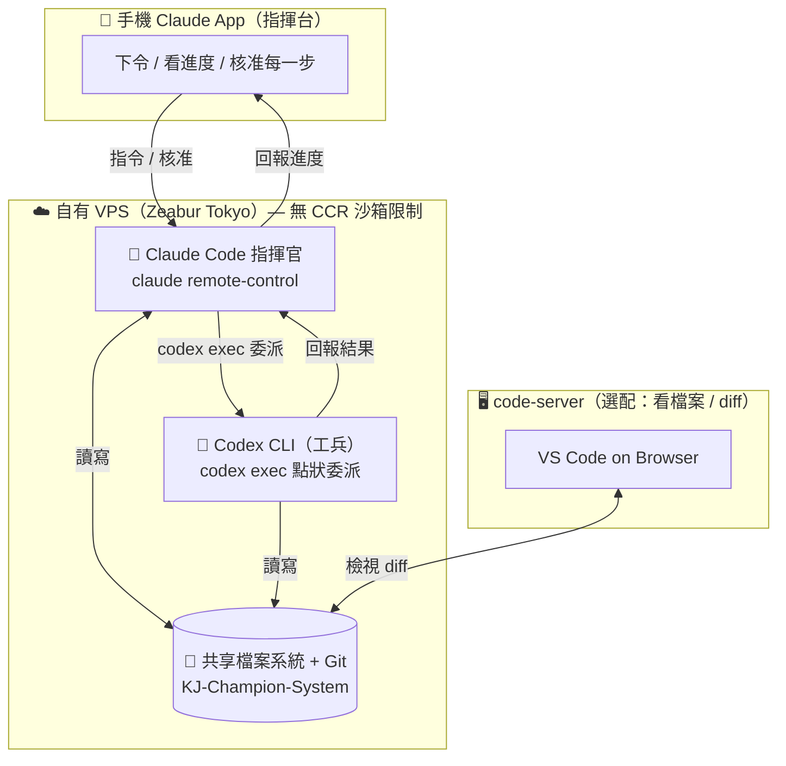

# 指揮官架構（Commander Architecture）

> 建立於 2026-07-17（CCR 評估 session，起於 code-server 可行性討論）。
> 定位：讓 **Claude Code 當「指揮官」**，在自有 VPS 上調度 **Codex CLI 當「工兵」**，
> 繞開手機 CCR 沙箱的限制。本文件供後續 session（尤其用最高階模型討論整體架構時）快速進入狀況。

---

## 一、緣起與定位

- **痛點 1**：之前嘗試 Codex + Claude Code「平行協作」不滿意——兩個平級 agent 各做各的、靠 GitHub 交接，手機上切檔案又麻煩，缺乏共同 ground truth。
- **痛點 2**：手機直連 CCR 沙箱有硬限制（`npm`/`node` 不可用、outbound 白名單鎖死、連不到 Zeabur DB），沙箱裡的 Claude 無法調度外部 CLI。
- **解法**：回到**自有 VPS**（無沙箱限制），由**一個 Claude Code 主導決策**，用 Bash 直接呼叫 `codex exec` 委派任務。大家在同一台機器、共享同一份 git = 統一真相。手機端用 `claude remote-control` 當指揮台看進度／核准。

**核心心智模型**：這是**編排（orchestration）**，不是多 agent 協作框架。指揮官點名叫工兵做單一任務，工兵無狀態、每次重餵 context。委派應是**點狀**（特定任務才委派），不是全程三方。

---

## 二、架構總覽



---

## 三、現況（2026-07-17 已完成並實測）

| 項目 | 狀態 | 備註 |
|---|---|---|
| VPS 環境 | ✅ | Zeabur Tokyo、Ubuntu 24.04、跑 K3s；資源健康（7.5G RAM / 2 核 / load 低），足以當指揮官主機 |
| Claude Code 指揮官 | ✅ | VPS 上以 `claude remote-control --name` 起 session，手機 Claude app 可接管 |
| Codex CLI | ✅ | `sudo npm install -g @openai/codex`（`codex-cli 0.144.3`），ChatGPT 訂閱登入（`Logged in using ChatGPT`） |
| 指揮鏈實測 | ✅ | Claude 指揮官用 `codex exec` 委派 codex 讀 `CLAUDE.md` 並總結，成功回報（總結內容正確）|
| code-server | ◻ 選配 | 評估過可用但**非必需**；卡頓根因是免費臨時 tunnel + 借用電腦瀏覽器，**不是 VPS** |
| Gemini CLI | ✖ 暫放棄 | 本次聚焦 Codex，Gemini 之後再議 |

---

## 四、關鍵技術點與注意事項

1. **環境判斷**：CCR 沙箱（手機 web）不能跑外部 CLI；VPS 才是指揮官的家。`/vps新對話` skill 已在管理 VPS 上的 remote-control session。
2. **Codex 沙箱 bubblewrap 問題**：VPS 是容器化 K3s 環境，限制了 unprivileged network namespace，Codex 預設 `read-only` 沙箱會因 bwrap 初始化失敗而**連讀檔都失敗**。實測需在委派時加 `--sandbox danger-full-access` 才跑得動。
3. **`danger-full-access` 取捨**：等同給 codex 完整檔案系統存取，**不建議當常態預設**。唯讀／低風險一次性任務可接受；日後委派**寫入類**任務要特別留意。長期應改用 `workspace-write` 沙箱（限制在專案目錄可寫）。
4. **安全底線仍在**：dev / prod 物理隔離（不同 Zeabur 專案）＋ prod DB 公網預設關閉。即使 codex 放寬權限，在 dev VPS 上也**觸不到 prod 正式資料**。
5. **成本 / 延遲**：指揮官（Claude）+ 工兵（codex）雙方各自計費，且「想→委派→等→整合」延遲會疊加。點狀委派、別全程三方。

---

## 五、待討論 / 待辦（給後續架構討論）

- [ ] **委派策略標準化**：把「何時委派 codex、怎麼餵 context」寫成 skill / slash command，讓指揮行為可重複。
- [ ] **沙箱收緊**：把常態委派從 `danger-full-access` 改為 `workspace-write`，在安全與可用間取平衡。
- [ ] **code-server 固定通道**：若確定要常駐用 code-server，需一個**自有網域**（現只有 pages.dev，建不了 Cloudflare named tunnel）＋ Cloudflare Access。
- [ ] **session 囤積清理**：VPS 上 remote-control session 有累積，用 `/vps新對話` 關閉模式定期清。
- [ ] **Gemini 是否納入**：目前放棄，未來若要多工兵再評估（注意：走 Codex/Gemini 的**本地 CLI 模式**，不要用雲端沙盒，否則重蹈平行協作不同步的覆轍）。

---

## 六、環境與操作速查

```bash
# 1) VPS 上起指揮官 session（Termius / VPS shell）
tmux new -d -s kj-cmd 'cd /home/ubuntu/dev/KJ-Champion-System && claude remote-control --name "KJ-指揮官"'
# → 手機 Claude app → Code 列表點「KJ-指揮官」接管

# 2) 指揮官委派 codex（在專案目錄內）
cd /home/ubuntu/dev/KJ-Champion-System && codex exec "任務描述"
# 若因 bubblewrap 讀檔失敗，暫加：
cd /home/ubuntu/dev/KJ-Champion-System && codex exec --sandbox danger-full-access "任務描述"

# 3) 確認 codex 登入
codex login status
```

- **專案路徑（VPS）**：`/home/ubuntu/dev/KJ-Champion-System`
- **連線**：Termius SSH 到 VPS（公網位址見 Zeabur Dashboard，勿寫入版控）
- **Codex 版本 / 模型**：`codex-cli 0.144.3`，實測走 `gpt-5.6` 系列
