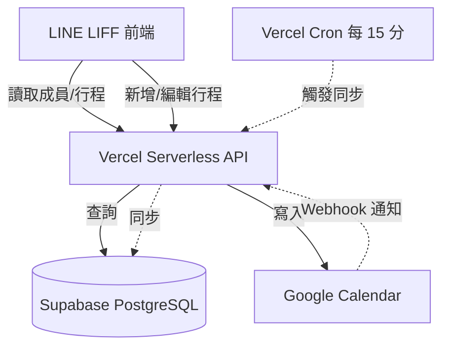

# Supabase + Vercel 遷移說明

本專案已從 Google Sheets 遷移至 **Supabase PostgreSQL**，並部署於 **Vercel Serverless** 平台。

## 快速開始

### 1. 環境準備

```bash
# 安裝依賴
npm install

# 複製環境變數範本
cp env.example .env
```

### 2. 設定 Supabase

1. 建立 Supabase 專案：https://supabase.com
2. 取得 `DATABASE_URL`（Transaction Mode）
3. 在 SQL Editor 執行 `database/schema.sql`

### 3. 設定 .env

編輯 `.env`，填入：
- `DATABASE_URL`（Supabase）
- `GOOGLE_SERVICE_ACCOUNT_EMAIL`、`GOOGLE_PRIVATE_KEY`、`GOOGLE_PROJECT_ID`
- `GROUP_CALENDAR_ID`
- `LIFF_ID`、`LINE_CHANNEL_ID`、`LINE_CHANNEL_SECRET`、`LINE_CHANNEL_ACCESS_TOKEN`

### 4. 遷移資料

```bash
# 遷移成員資料（從 Google Sheets）
npm run migrate:members

# 初次同步行程（從 Google Calendar）
npm run sync:calendar
```

### 5. 部署至 Vercel

```bash
# 方法一：使用 Vercel CLI
vercel

# 方法二：連結 GitHub，透過 Dashboard 部署
# 前往 https://vercel.com/dashboard 匯入專案
```

### 6. 註冊 Calendar Watch

部署完成後，更新 `.env` 的 `APP_URL` 為 Vercel 網址，執行：

```bash
npm run watch:register
```

## 架構說明



## 同步機制

1. **LIFF 讀取**：從 Supabase PostgreSQL（快速、無配額限制）
2. **LIFF 寫入**：寫入 Google Calendar（保留現有邏輯）
3. **自動同步**：
   - **Vercel Cron**：每 15 分鐘從 Calendar 同步至 Supabase
   - **Calendar Watch Webhook**：Calendar 變更時即時同步

## npm 指令

```bash
# 開發
npm run dev              # 本機啟動（需設定 DATABASE_URL）

# 遷移
npm run migrate:members  # 遷移 Google Sheets 成員至 Supabase
npm run sync:calendar    # 初次同步 Calendar 行程至 Supabase

# Watch 管理
npm run watch:register   # 註冊 Calendar Watch（部署後執行一次）
npm run watch:renew      # 手動續期 Watch

# 測試
npm test
```

## 環境變數

| 變數 | 必要 | 說明 |
|------|------|------|
| `DATABASE_URL` | ✅ | Supabase 連線字串 |
| `GOOGLE_SERVICE_ACCOUNT_EMAIL` | ✅ | Service Account Email |
| `GOOGLE_PRIVATE_KEY` | ✅ | Service Account 私鑰 |
| `GOOGLE_PROJECT_ID` | ✅ | Google Cloud 專案 ID |
| `GROUP_CALENDAR_ID` | ✅ | 團體日曆 ID |
| `APP_URL` | ✅ | Vercel 部署網址（Webhook 用） |
| `LIFF_ID` | ✅ | LINE LIFF ID |
| `LINE_CHANNEL_ID` | ✅ | LINE Channel ID |
| `LINE_CHANNEL_SECRET` | ✅ | LINE Channel Secret |
| `LINE_CHANNEL_ACCESS_TOKEN` | ✅ | LINE Access Token |
| `CRON_SECRET` | 選填 | Cron 認證密鑰 |

## 詳細文件

- [Supabase-Vercel 部署完整指南](./docs/Supabase-Vercel部署完整指南.md)
- [遷移至 Supabase-Vercel 摘要](./docs/遷移至Supabase-Vercel摘要.md)
- [Vercel vs Zeabur 詳細比較](./docs/Vercel%20vs%20Zeabur%20詳細比較.md)

## 故障排除

### 問題：Vercel 部署後 500 錯誤

**檢查**：
1. Vercel Dashboard → Settings → Environment Variables，確認 `DATABASE_URL` 等已設定
2. Vercel Dashboard → Deployments → 查看 Function Logs

### 問題：Supabase 連線失敗

**檢查**：
1. `DATABASE_URL` 使用 **Transaction Mode**（port 6543），不是 Session Mode
2. Supabase Dashboard → Settings → Database，確認 Connection Pooler 已啟用

### 問題：Calendar Webhook 沒收到通知

**檢查**：
1. `APP_URL` 是否正確（需 HTTPS）
2. Watch 是否已註冊：`npm run watch:register`
3. Watch 是否過期：查看 Supabase `calendar_watches` 表

### 問題：行程顯示延遲

**解法**：
1. 調整 Cron 頻率（`vercel.json` 的 schedule）
2. 確認 Calendar Watch 已註冊並運作

---

## 聯絡與支援

若遇到問題，請檢查：
1. Vercel Function Logs
2. Supabase Dashboard → Logs
3. 本機執行 `npm run dev` 測試連線

祝部署順利！ 🚀
