# OpenSpec STATUS

> 每次對話的導航起點。只看不寫（不在此輸入需求）。
> 「修改計畫」或「執行計畫」前必讀，讀完確認位置後再行動。

---

## 路線圖

```mermaid
graph LR
  01["✅ 01\nzeabur-infra-and-db"]
  02["✅ 02\ncloudflare-pages-validate"]
  025["✅ 025\nhtml-production-deploy"]
  06["✅ 06\n新UI前端開發"]
  07["✅ 07\noauth動態redirect"]
  08["🗄️ 08\ndev-test-database\n(superseded by 10)"]
  09["✅ 09\n每日行程推播\n(v2.2.0 後端 + v2.3.0 前端)"]
  10["✅ 10\nzeabur-projects-split\n(v2.1.0)"]
  12["🛠 12\n統一彈出訊息系統\n(進行中)"]

  01 --> 02 --> 025 --> 06 --> 07 --> 08 --> 09 --> 10 --> 12

  style 01 fill:#d4edda,stroke:#28a745,color:#155724
  style 02 fill:#d4edda,stroke:#28a745,color:#155724
  style 025 fill:#d4edda,stroke:#28a745,color:#155724
  style 06 fill:#d4edda,stroke:#28a745,color:#155724
  style 07 fill:#d4edda,stroke:#28a745,color:#155724
  style 08 fill:#e2e3e5,stroke:#6c757d,color:#495057
  style 09 fill:#d4edda,stroke:#28a745,color:#155724
  style 10 fill:#d4edda,stroke:#28a745,color:#155724
  style 12 fill:#fff3cd,stroke:#856404,color:#856404
```

| # | Change | 狀態 | 說明 |
| --- | --- | --- | --- |
| 01 | [zeabur-infra-and-db](changes/01-zeabur-infra-and-db/tasks.md) | ✅ ARCHIVED | Zeabur DB + 後端部署，全完成 |
| 02 | [cloudflare-pages-validate](changes/02-cloudflare-pages-validate/tasks.md) | ✅ DONE | Cloudflare Pages 前後端串接驗證 |
| 025 | [html-production-deploy](changes/025-html-production-deploy/tasks.md) | ✅ DONE | staging HTML 版部署 main 完成 |
| 06 | [新UI前端開發](changes/06-新UI前端開發/tasks.md) | ✅ DONE | React+Vite+PWA 新UI，合併 main（v2.0.0） |
| 07 | [oauth動態redirect](changes/07-oauth動態redirect/tasks.md) | ✅ DONE | OAuth redirect 自動偵測 origin（v1.6.0） |
| 08 | dev-test-database（在 `m_b_dev_test_database` 分支上） | 🗄️ SUPERSEDED | **被 10 取代並 archive**。資料夾未進 main，10 上線後可砍 `m_b_dev_test_database` 分支 |
| 09 | [每日行程推播](changes/09-每日行程推播/tasks.md) | ✅ DONE | 後端 v2.2.0 + 前端 v2.3.0 全部上線 — LINE Bot 每日定時推送 + 開發者設定頁（含 Eruda toggle）|
| 10 | [zeabur-projects-split](changes/10-zeabur-projects-split/tasks.md) | ✅ DONE | Zeabur 專案分離 — dev 與 prod 完全物理隔離（v2.1.0 上線） |
| 11 | （預留） tag-system | ⬜ PENDING | 尚未動工，編號預留給 `m_b_tag_*` 三段式合 |
| 12 | [統一彈出訊息系統](changes/12-統一彈出訊息系統/tasks.md) | 🛠 IN PROGRESS | 替換 14 處 `alert/confirm` 為 Warm Minimal 風格 Toast / Dialog / FieldError（分支 `m_b_統一彈出訊息系統`） |

---

## 當前 Change：12-統一彈出訊息系統 — 🛠 IN PROGRESS

`████░░░░░░░░░░` 8 / 33（基礎元件 8 + 元件遷移 3 + 替換 10 + 規範 2 + 驗證 6 + 上線 9 — 上線階段不計入實作完成度）

### 分支
- `m_b_統一彈出訊息系統`（純前端，已從 main 切出並推遠端）

### 範圍速覽
- 新建 `frontend/src/components/feedback/` 套件：`Dialog` / `ConfirmDialog` / `Toast` / `BottomSheet` / `FieldError` / `FeedbackProvider`
- 替換 14 處瀏覽器原生 `alert/confirm`（散落 8 個檔案）
- 既有自製元件遷移：`ConfirmLeaveDialog` / `ShareConfirmDialog` / `AmountPicker` 改用統一 base
- 規範寫進 `.claude/rules/frontend.md` 與根目錄 `UIDESIGN.md`
- 上線版本：v2.4.0

### ✅ 已完成（1.x feedback 套件 + App 包 Provider）
- [x] 1.1 `Dialog.jsx` base
- [x] 1.2 `ConfirmDialog.jsx`（消費 Dialog，default / danger variant）
- [x] 1.3 `Toast.jsx` + `ToastContainer.jsx`（左側色條 + 自動消失 + 堆疊 + z-[70]）
- [x] 1.4 `BottomSheet.jsx`（底部抽屜 + 把手）
- [x] 1.5 `FieldError.jsx`（紅字 + dot bullet）
- [x] 1.6 `FeedbackProvider.jsx`（context + Promise API for confirm/sheet）
- [x] 1.7 `index.js`（barrel export）
- [x] 1.8 `App.jsx` 最外層包 `<FeedbackProvider>`

### 下一步
2.x 既有元件遷移（ConfirmLeaveDialog / ShareConfirmDialog / AmountPicker）

---

## 已完成 Change：09-每日行程推播 — ✅ DONE（v2.2.0 後端 + v2.3.0 前端）

`██████████████` 後端 20 / 20 ✅、前端 11 / 11 ✅

### 上線版本

- 後端 v2.2.0（main commit `9f18745`，2026-04-25）
- 前端 v2.3.0（main commit 待 push，2026-04-26）

### 即將砍除的分支

- `m_b_每日行程推播_backend`（v2.3.0 上線後一起砍）
- `m_b_每日行程推播_frontend`（v2.3.0 上線後砍）

### ✅ 後端已完成（20/20，v2.2.0）

#### 1. 依賴與 DB
- [x] 1.1 `package.json` 新增 `node-cron` 依賴
- [x] 1.2 `server/server.js` 新增 `system_settings` 表自動 migration（time=21:00 / enabled=true / target=developer）

#### 2. 核心服務
- [x] 2.1 `server/services/agendaService.js`（讀寫設定、過濾對象、推播主流程）
- [x] 2.2 `server/services/lineService.js` 新增 `generateDailyAgendaFlexMessage()`
- [x] 2.3 `server/scheduler/dailyAgenda.js`（start / stop / reschedule，timezone 固定 Asia/Taipei）

#### 3. API
- [x] 3.1 `GET /api/line/agenda-settings`（僅開發者）
- [x] 3.2 `PUT /api/line/agenda-settings`（僅開發者）
- [x] 3.3 `POST /api/line/push-daily-agenda`（手動觸發，僅開發者）

#### 4. 整合
- [x] 4.1 `server/server.js` 啟動 scheduler、掛 graceful shutdown

#### 5. 驗證 + 視覺迭代（dev 上連續多日 23:30 推播驗證）
- [x] 5.1 ~ 5.3 dev 後端排程啟動 + 手動 push API + 設定 API 讀寫
- [x] 5.5.1 ~ 5.5.4 字卡 v1：時區 bug 修復、移除 emoji、加 dot bullet、類型膠囊 badge、Header accent 色、可點進 event 詳情
- [x] 5.6.1 ~ 5.6.4 字卡 v2：body 改米白底、event row 卡片化（白底 + 邊框 + 圓角 + padding）、移除多餘 separator、連續多日 23:30 收推視為已驗證

### ✅ 前端完成（11/11，v2.3.0 上線）

#### 6. 設定頁面
- [x] 6.1 `frontend/src/pages/AgendaSettings.jsx`（toggle / 時間 / 對象下拉 / 儲存 / 立即推播 / 權限檢查 + 加碼 Eruda toggle）

#### 7. 前端整合
- [x] 7.1 `frontend/src/services/api.js` 新增 3 個 API 方法
- [x] 7.2 `frontend/src/components/FabNav.jsx` 新增開發者入口（role gate）
- [x] 7.3 `frontend/src/App.jsx` 新增 `/agenda-settings` 路由
- [x] 7.4 `frontend/index.html` 加 Eruda inline script loader
- [x] 7.5 `frontend/index.html` 加 `mobile-web-app-capable` meta tag（PWA deprecated 警告補正）

#### 8. 驗證
- [x] 8.1 merge frontend 分支到 dev 並 push
- [x] 8.2 開發者帳號登入，FabNav 顯示「開發者設定」入口
- [x] 8.3 設定頁讀寫、手動推播、權限控制全部正確（dev DB 用 `scripts/seed-dev-agenda-test.js` 寫入 developer + 4/27 event 後實機驗證通過）
- [x] 8.4 Eruda toggle 開關 + 重整後右下角綠色按鈕出現
- [x] 8.5 非開發者帳號訪問 `/agenda-settings` 顯示「無存取權限」（用 localStorage swap lineUserId 驗證）

### 已完成的 v2.1.0 / v2.0.5 ~ v2.0.8（archived，詳見 .claude/context/）

- v2.1.0 — Zeabur 專案分離 + dev/prod 物理隔離（OpenSpec change 10）
- v2.0.5 ~ v2.0.8 — onboarding 流程四連 hotfix

---

> **進行中**：12-統一彈出訊息系統（v2.4.0 目標）
> **後續排隊**：`m_b_tag_*` 三段式合（11-tag-system）、`m_b_pwa_upgrade`

---

## 編號讓號紀錄

- 09-zeabur-projects-split → **10-zeabur-projects-split**（2026-04-25）
- 原因：手機端在 dev 上已用 09 = 每日行程推播。PC 後到，禮讓編號。
- commit history 內 `chore(09)` message 保留（不可改），但所有檔案內容已更新為 10。

---

## 工作流提醒

| 指令 | 動作順序 |
| --- | --- |
| 「修改計畫」 | 讀此檔 → `proposal.md` → `design.md` → `tasks.md` → 更新此檔 |
| 「執行計畫」 | 讀此檔 → `tasks.md` → 實作程式碼 → 更新 `tasks.md` → 更新此檔 |

> **關鍵原則**：修改計畫從 `proposal` 開始，`tasks` 永遠最後更新。

---

*最後更新：2026-04-26（12 開立 — 統一彈出訊息系統，分支 `m_b_統一彈出訊息系統` 已切，OpenSpec change 三件套就緒，等候「執行計畫」）*
