# OpenSpec STATUS

> 每次對話的導航起點。只看不寫（不在此輸入需求）。
> 「修改計畫」或「執行計畫」前必讀，讀完確認位置後再行動。

---

## 路線圖

```mermaid
graph LR
  01["✅ 01\nzeabur-infra-and-db"]
  02["✅ 02\ncloudflare-pages-validate"]
  025["✅ 025\nhtml-production-deploy"]
  06["✅ 06\n新UI前端開發"]
  07["✅ 07\noauth動態redirect"]
  08["🗄️ 08\ndev-test-database\n(superseded by 10)"]
  09["🔄 09\n每日行程推播"]
  10["✅ 10\nzeabur-projects-split\n(v2.1.0)"]

  01 --> 02 --> 025 --> 06 --> 07 --> 08 --> 09 --> 10

  style 01 fill:#d4edda,stroke:#28a745,color:#155724
  style 02 fill:#d4edda,stroke:#28a745,color:#155724
  style 025 fill:#d4edda,stroke:#28a745,color:#155724
  style 06 fill:#d4edda,stroke:#28a745,color:#155724
  style 07 fill:#d4edda,stroke:#28a745,color:#155724
  style 08 fill:#e2e3e5,stroke:#6c757d,color:#495057
  style 09 fill:#fff3cd,stroke:#ffc107,color:#856404
  style 10 fill:#d4edda,stroke:#28a745,color:#155724
```

| # | Change | 狀態 | 說明 |
| --- | --- | --- | --- |
| 01 | [zeabur-infra-and-db](changes/01-zeabur-infra-and-db/tasks.md) | ✅ ARCHIVED | Zeabur DB + 後端部署，全完成 |
| 02 | [cloudflare-pages-validate](changes/02-cloudflare-pages-validate/tasks.md) | ✅ DONE | Cloudflare Pages 前後端串接驗證 |
| 025 | [html-production-deploy](changes/025-html-production-deploy/tasks.md) | ✅ DONE | staging HTML 版部署 main 完成 |
| 03 | [pencil-ui-design](changes/03-pencil-ui-design/tasks.md) | ⬜ ON HOLD | 設計稿（Pencil）— v2.0 React 上線後此 change 已被取代 |
| 04 | [react-vite-pwa-frontend](changes/04-react-vite-pwa-frontend/tasks.md) | ✅ SUPERSEDED | React 重構 — 由 06 完成 |
| 05 | [production-cutover](changes/05-production-cutover/tasks.md) | ✅ SUPERSEDED | React 版正式切換 — 由 06 + v2.0 系列完成 |
| 06 | [新UI前端開發](changes/06-新UI前端開發/tasks.md) | ✅ DONE | React+Vite+PWA 新UI，合併 main（v2.0.0） |
| 07 | [oauth動態redirect](changes/07-oauth動態redirect/tasks.md) | ✅ DONE | OAuth redirect 自動偵測 origin（v1.6.0） |
| 08 | dev-test-database（在 `m_b_dev_test_database` 分支上） | 🗄️ SUPERSEDED | **被 10 取代並 archive**。資料夾未進 main，10 上線後可砍 `m_b_dev_test_database` 分支 |
| 09 | 每日行程推播（在 `m_b_每日行程推播_*` 分支上，手機端維護） | 🔄 IN PROGRESS | LINE Bot 每日定時推送明日行程 |
| 10 | [zeabur-projects-split](changes/10-zeabur-projects-split/tasks.md) | ✅ DONE | Zeabur 專案分離 — dev 與 prod 完全物理隔離（v2.1.0 上線） |

---

## 當前 Change：10-zeabur-projects-split — ✅ 已完成

`█████████████` 100% — 完成 14 / 14 個子任務（v2.1.0 上線）

### 進行分支

`m_b_zeabur_projects_split` → 即將 merge main 走 v2.1.0「功能上線」流程

### ✅ 全部完成（14/14）

#### 階段一：建立新 Zeabur 環境
- [x] 10.1 新建 Zeabur 專案 `kj-champion-dev`
- [x] 10.2 新專案建 `postgresql-dev`（公網 30967）
- [x] 10.3 PC schema dump → 套到新 dev DB（5 tables 與 prod 一致）

#### 階段二：建立新 dev 後端
- [x] 10.4 新專案建 `kj-champion-system-dev` 後端（連 dev branch）
- [x] 10.5 新 dev 後端環境變數（DATABASE_URL = 內網、APP_URL = 新公網）
- [x] 10.6 取得新後端 URL `kj-champion-dev.zeabur.app`

#### 階段三：前端與外部設定
- [x] 10.7 修改 `_worker.js` 指向新 URL
- [x] 10.8 LINE Console 加新 callback URL
- [x] 10.9 Cloudflare Pages preview build 確認

#### 階段四：驗證與切換
- [x] 10.10 dev 全鏈路驗證（讀寫雙向 + DB 隔離 24 vs 0）
- [x] 10.11 砍舊 `kj-champion` 專案內的 `postgresql-test` 與 `kj-champion-system-dev`

#### 階段五：prod DB 安全強化
- [x] 10.12 prod DB 密碼旋轉（PC ALTER USER + Zeabur env var 同步 + 重啟 prod 後端）
- [x] 10.13 關 prod DB 公網路（兩步驗證後 toggle 關，prod 站續正常）

#### 階段六：收尾
- [x] 10.14 文件更新（NOW.md / README / database.md / deploy.md）+ STATUS.md 更新

### 連帶完成的 hotfix（dev DB cold-start 觸發的 main 設計-實作落差）

- v2.0.5 — Login.jsx no-profile 死循環
- v2.0.6 — useEffect / handleConfirm navigate race condition
- v2.0.7 — 新用戶 onboarding 強制流程（4 檔修補）
- v2.0.8 — onboarding 完成後導主頁

---

## 並行 Change：09-每日行程推播

由手機 Claude Code 維護於 `m_b_每日行程推播_backend` / `m_b_每日行程推播_frontend` 分支，**PC 不主動接手**。後端已合進 dev 待測試。

---

> **下一步**：m_b_zeabur_projects_split → main 走 v2.1.0「功能上線」流程，砍分支、同步、archive `m_b_dev_test_database`。

---

## 編號讓號紀錄

- 09-zeabur-projects-split → **10-zeabur-projects-split**（2026-04-25）
- 原因：手機端在 dev 上已用 09 = 每日行程推播。PC 後到，禮讓編號。
- commit history 內 `chore(09)` message 保留（不可改），但所有檔案內容已更新為 10。

---

## 工作流提醒

| 指令 | 動作順序 |
| --- | --- |
| 「修改計畫」 | 讀此檔 → `proposal.md` → `design.md` → `tasks.md` → 更新此檔 |
| 「執行計畫」 | 讀此檔 → `tasks.md` → 實作程式碼 → 更新 `tasks.md` → 更新此檔 |

> **關鍵原則**：修改計畫從 `proposal` 開始，`tasks` 永遠最後更新。

---

*最後更新：2026-04-25*
