# OpenSpec STATUS

> 每次對話的導航起點。只看不寫（不在此輸入需求）。
> 「修改計畫」或「執行計畫」前必讀，讀完確認位置後再行動。

---

## 路線圖

```mermaid
graph LR
  01["✅ 01\nzeabur-infra-and-db"]
  02["✅ 02\ncloudflare-pages-validate"]
  025["✅ 025\nhtml-production-deploy"]
  06["✅ 06\n新UI前端開發"]
  07["✅ 07\noauth動態redirect"]
  08["⏸️ 08\ndev-test-database\n(superseded by 09)"]
  09["🔄 09\nzeabur-projects-split\n← CURRENT"]

  01 --> 02 --> 025 --> 06 --> 07 --> 08 --> 09

  style 01 fill:#d4edda,stroke:#28a745,color:#155724
  style 02 fill:#d4edda,stroke:#28a745,color:#155724
  style 025 fill:#d4edda,stroke:#28a745,color:#155724
  style 06 fill:#d4edda,stroke:#28a745,color:#155724
  style 07 fill:#d4edda,stroke:#28a745,color:#155724
  style 08 fill:#e2e3e5,stroke:#6c757d,color:#495057
  style 09 fill:#fff3cd,stroke:#ffc107,color:#856404
```

| # | Change | 狀態 | 說明 |
| --- | --- | --- | --- |
| 01 | [zeabur-infra-and-db](changes/01-zeabur-infra-and-db/tasks.md) | ✅ ARCHIVED | Zeabur DB + 後端部署，全完成 |
| 02 | [cloudflare-pages-validate](changes/02-cloudflare-pages-validate/tasks.md) | ✅ DONE | Cloudflare Pages 前後端串接驗證 |
| 025 | [html-production-deploy](changes/025-html-production-deploy/tasks.md) | ✅ DONE | staging HTML 版部署 main 完成 |
| 06 | [新UI前端開發](changes/06-新UI前端開發/tasks.md) | ✅ DONE | React+Vite+PWA 新UI，合併 main（v2.0.0） |
| 07 | [oauth動態redirect](changes/07-oauth動態redirect/tasks.md) | ✅ DONE | OAuth redirect 自動偵測 origin（v1.6.0） |
| 08 | [dev-test-database](changes/08-dev-test-database/tasks.md) | ⏸️ ON HOLD | dev 測試 DB 獨立化 — **被 09 取代**，09 完成後 archive |
| 09 | [zeabur-projects-split](changes/09-zeabur-projects-split/tasks.md) | 🔄 **CURRENT** | Zeabur 專案分離 — dev 與 prod 完全物理隔離 |

---

## 當前 Change：09-zeabur-projects-split

`░░░░░░░░░░░░░` 0% — 完成 0 / 14 個子任務

### 進行分支

`m_b_zeabur_projects_split`（PC 本地 + 使用者手動 Zeabur Dashboard 並行）

### 待完成（依依賴順序）

#### 階段一：建立新 Zeabur 環境
- [ ] 9.1 新建 Zeabur 專案 `kj-champion-dev`（使用者）
- [ ] 9.2 新專案建 `postgresql-test`（使用者）
- [ ] 9.3 PC schema dump → 套到新 test DB（Claude）

#### 階段二：建立新 dev 後端
- [ ] 9.4 新專案建 `kj-champion-system-dev` 後端（使用者）
- [ ] 9.5 新 dev 後端環境變數（使用者）
- [ ] 9.6 取得新 dev 後端 URL（使用者）

#### 階段三：前端與外部設定
- [ ] 9.7 修改 `_worker.js` 指向新 URL（Claude）
- [ ] 9.8 LINE Console 加新 callback URL（使用者）
- [ ] 9.9 Cloudflare Pages preview build 確認（使用者）

#### 階段四：驗證與切換
- [ ] 9.10 dev 全鏈路驗證（使用者）
- [ ] 9.11 砍掉舊 dev 服務（kj-champion 專案內）（使用者）

#### 階段五：prod DB 安全強化
- [ ] 9.12 prod DB 密碼旋轉（Claude + 使用者）
- [ ] 9.13 關 prod DB 公網路（兩步驗證）（使用者）

#### 階段六：收尾
- [ ] 9.14 文件更新 + archive 08（Claude）

---

> **目前等待**：使用者開始 9.1（在 Zeabur dashboard 新建 `kj-champion-dev` 專案）

---

## 工作流提醒

| 指令 | 動作順序 |
| --- | --- |
| 「修改計畫」 | 讀此檔 → `proposal.md` → `design.md` → `tasks.md` → 更新此檔 |
| 「執行計畫」 | 讀此檔 → `tasks.md` → 實作程式碼 → 更新 `tasks.md` → 更新此檔 |

> **關鍵原則**：修改計畫從 `proposal` 開始，`tasks` 永遠最後更新。

---

*最後更新：2026-04-25*
