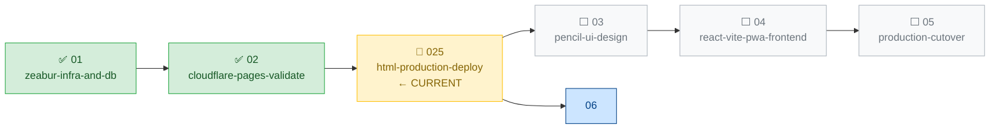

# OpenSpec STATUS

> 每次對話的導航起點。只看不寫（不在此輸入需求）。
> 「修改計畫」或「執行計畫」前必讀，讀完確認位置後再行動。

---

## 路線圖

| # | Change | 狀態 | 說明 |
| --- | --- | --- | --- |
| 01 | [zeabur-infra-and-db](changes/01-zeabur-infra-and-db/tasks.md) | ✅ ARCHIVED | Zeabur DB + 後端部署，全完成 |
| 02 | [cloudflare-pages-validate](changes/02-cloudflare-pages-validate/tasks.md) | ✅ DONE | Cloudflare Pages 前後端串接驗證，全部通過 |
| 025 | [html-production-deploy](changes/025-html-production-deploy/tasks.md) | 🔄 **CURRENT** | staging HTML 版部署 main + 驗證 + 清空 staging |
| 03 | [pencil-ui-design](changes/03-pencil-ui-design/tasks.md) | ⬜ NEXT | 設計稿（Pencil），進入前提：025 完成 |
| 04 | [react-vite-pwa-frontend](changes/04-react-vite-pwa-frontend/tasks.md) | ⬜ FUTURE | React 重構，進入前提：03 完成 |
| 05 | [production-cutover](changes/05-production-cutover/tasks.md) | ⬜ FUTURE | React 版正式切換，進入前提：04 通過 |
| 06 | [新UI前端開發](changes/06-新UI前端開發/tasks.md) | ✅ DONE | React+Vite+PWA 新UI，已合併 main（v2.0.0） |
| 07 | [oauth動態redirect](changes/07-oauth動態redirect/tasks.md) | ✅ DONE | 後端 OAuth redirect 自動偵測前端 origin，已合併 main（v1.6.0） |
| 09 | [每日行程推播](changes/09-每日行程推播/tasks.md) | 🔄 IN PROGRESS | LINE Bot 每日定時推送明日行程（前後端獨立分支） |

---

## 當前 Change：025-html-production-deploy

`████░░░░░░░░░` 31% — 完成 4 / 13 個子任務

### ✅ 已完成

- [x] **025.3 Zeabur 建立正式後端服務**（`kj-champion-system.zeabur.app`，Branch: main）
- [x] **025.4 設定正式環境變數**（含 FRONTEND_URL 改為 Cloudflare Pages URL）
- [x] **025.5 LINE Console 新增正式 Callback URL**
- [x] **025.12 更新 `_worker.js`**（ZEABUR_BACKEND 已改為正式後端 URL）

### ⬜ 待完成

---

- [ ] **025.4 設定正式環境變數**（使用者手動 — Zeabur Dashboard）
  - `DATABASE_URL`（Zeabur PostgreSQL 內網連線字串）
  - `LINE_CHANNEL_ID`、`LINE_CHANNEL_SECRET`
  - `GOOGLE_CLIENT_ID`、`GOOGLE_CLIENT_SECRET` 等 Google 相關
  - `FRONTEND_URL=https://kj-champion-system.pages.dev`
  - `NODE_ENV=production`

- [ ] **025.1 建立 PR staging → main**（Claude git）
  - 025.12 程式碼更新後由 Claude 協助建 PR

- [ ] **025.2 確認 Cloudflare Pages main build 成功**（使用者驗證）
  - merge PR 後，Cloudflare Pages 自動觸發 main branch build
  - 確認 build log 無錯誤

- [ ] **025.6 Cloudflare Pages Production branch 切換**（使用者手動 — Cloudflare Dashboard）
  1. Cloudflare Pages → `kj-champion-system` → Settings → Builds & deployments
  2. Production branch 改為 `main`
  3. 觸發重新部署

- [ ] **025.7 確認 Production 部署成功**（使用者驗證）
  - 開啟 `https://kj-champion-system.pages.dev`，確認頁面正常

- [ ] **025.8 API 溝通驗證**（使用者驗證）
  - 確認 `/api/members`、`/api/calendar/events` 回應正確

- [ ] **025.9 資料庫連線驗證**（使用者驗證）
  - 新增 / 刪除測試行程，確認資料落在 Zeabur PostgreSQL

- [ ] **025.10 LINE Login 完整流程**（使用者驗證）
  - 清除 localStorage → 登入 → 確認回跳並正常使用

- [ ] **025.11 停止 Zeabur staging 後端服務**（使用者手動 — Zeabur Dashboard）
  - Zeabur → 原 staging 服務 → Suspend 或 Delete

- [ ] **025.13 ✅ 完成**（Claude 更新文件）
  - archive 此 change，STATUS.md 切換至 03-pencil-ui-design

---

> **進入下一階段條件**：025.13 通過
> **目前等待**：025.4 環境變數設定完成 + 025.5 LINE Console 設定後，由 Claude 建 PR（025.1）

---

## 工作流提醒

| 指令 | 動作順序 |
| --- | --- |
| 「修改計畫」 | 讀此檔 → `proposal.md` → `design.md` → `tasks.md` → 更新此檔 |
| 「執行計畫」 | 讀此檔 → `tasks.md` → 實作程式碼 → 更新 `tasks.md` → 更新此檔 |

> **關鍵原則**：修改計畫從 `proposal` 開始，`tasks` 永遠最後更新。

---

*最後更新：2026-04-04*
